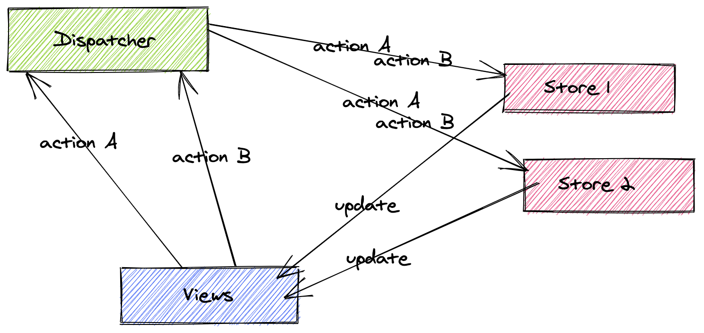

# Fluc - an implementation of the Flux architecture

## Overview

[Flux](http://facebook.github.io/flux/) is an architectural design pattern for building user interfaces.

Dispatcher's job is to recieve the actions from views (e.g a React component) and pass them to stores. The store then decides if it needs to change it's internal state. If it does, these changes are propogated to the view layer. In case of React these changes can trigger a re-render. Actions can come from anywhere: a React component, a module that performs an http request etc.
